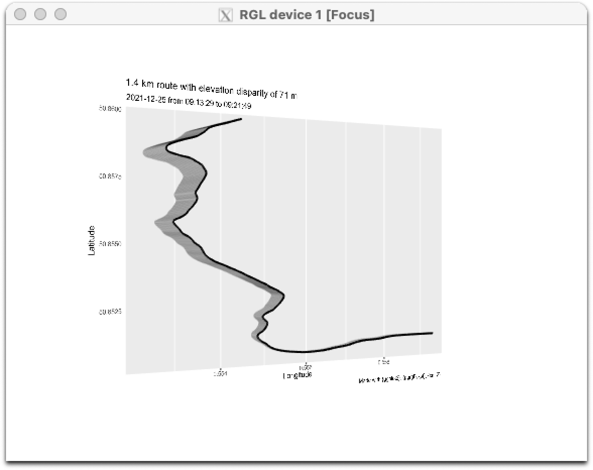
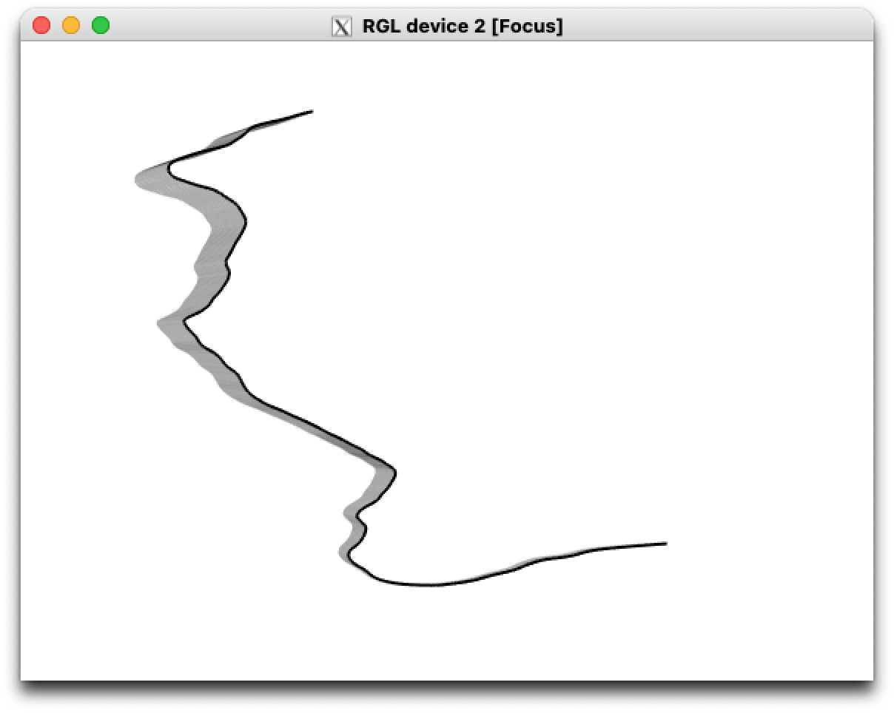
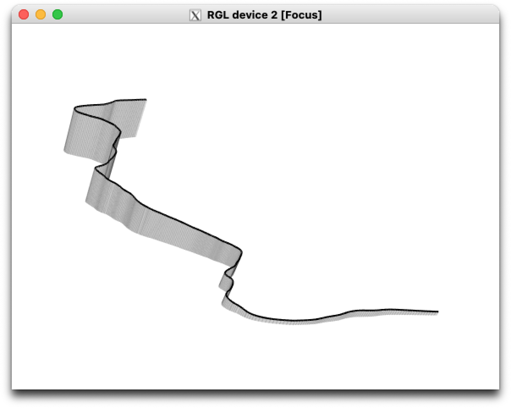

<!-- README.md is generated from README.Rmd. Please edit that file -->

# {gpx3d}

<!-- badges: start -->

[](https://www.repostatus.org/#wip)
[](https://CRAN.R-project.org/package=gfx3d)
[](https://github.com/matt-dray/gpx3d/actions)
[](https://codecov.io/gh/matt-dray/gpx3d?branch=main)
[](https://github.com/matt-dray/gpx3d)
<!-- badges: end -->

An in-development, opinionated R package to create interactive 3D plots
of workout routes.

Takes a .gpx file—downloaded from the Apple Health app, for example—and
extracts the time, coordinates and elevation into an sf-class object.
You can then plot this as a 3D interactive object thanks to
[{ggrgl}](https://coolbutuseless.github.io/package/ggrgl/index.html).

## Install

The package is available from GitHub only.

``` r
install.packages("remotes")  # if not installed already
remotes::install_github("matt-dray/gpx3d")
library(gpx3d)
```

There are a number of dependencies, including many that are not
available on CRAN; see [the README for
{ggrgl}](https://coolbutuseless.github.io/package/ggrgl/index.html#installation)
for details. You must also [install XQuartz](https://www.xquartz.org/),
if you haven’t already.

## Demo

The package contains an example GPX file with an edited segment of a
route I took as part of a 10 km run on Christmas morning 2021. It can be
read in with `extract_gpx3d()`, which outputs an sf-class data.frame
with geospatial information. (Alternatively, you can output a simpler
data.frame object with the `extract_gpx3d()` argument `sf_out = FALSE`.)

``` r
x <- system.file("extdata", "segment.gpx", package = "gpx3d")
y <- extract_gpx3d(x)
y
```

    # Simple feature collection with 501 features and 5 fields
    # Geometry type: POINT
    # Dimension:     XY
    # Bounding box:  xmin: 0.552347 ymin: 50.85061 xmax: 0.559273 ymax: 50.85968
    # Geodetic CRS:  WGS 84
    # First 10 features:
    #                   time      ele      lon      lat                  geometry     distance
    # 1  2021-12-25 09:13:29 8.406136 0.559273 50.85109 POINT (0.559273 50.85109) 0.000000 [m]
    # 2  2021-12-25 09:13:30 8.498508 0.559209 50.85109 POINT (0.559209 50.85109) 4.494285 [m]
    # 3  2021-12-25 09:13:31 8.599027 0.559144 50.85109 POINT (0.559144 50.85109) 4.564465 [m]
    # 4  2021-12-25 09:13:32 8.721706 0.559079 50.85109 POINT (0.559079 50.85109) 4.564465 [m]
    # 5  2021-12-25 09:13:34 8.858613 0.559015 50.85109 POINT (0.559015 50.85109) 4.492909 [m]
    # 6  2021-12-25 09:13:35 9.007253 0.558952 50.85109 POINT (0.558952 50.85109) 4.422707 [m]
    # 7  2021-12-25 09:13:36 9.154713 0.558889 50.85109 POINT (0.558889 50.85109) 4.424104 [m]
    # 8  2021-12-25 09:13:37 9.315786 0.558825 50.85109 POINT (0.558825 50.85109) 4.494284 [m]
    # 9  2021-12-25 09:13:38 9.493576 0.558762 50.85109 POINT (0.558762 50.85109) 4.422707 [m]
    # 10 2021-12-25 09:13:39 9.686247 0.558699 50.85109 POINT (0.558699 50.85109) 4.424104 [m]

Note that the result of `extract_gpx3d(x)` is also available in the
package as the demo dataset `gpx_segment`.

Now you can use `plot_gpx3d()` to plot the output from
`extract_gpx3d()`. This opens in an external RGL device.

``` r
plot_gpx3d(y)
```

The plots can’t be embedded here, so here’s a low-quality screenshot of
the device:

<div class="figure">



</div>

The title gives the route length (1.4 km) and the elevation difference
from lowest to highest points (71 m); the subtitle gives the date
(2021-12-25) and the start (09:13:29) to end (09:21:49) times. X and Y
are longitude and latiutude.

You can use `route_only = TRUE` to remove all of the chart elements
except for the route itself:

``` r
plot_gpx3d(y, route_only = TRUE)
```

<div class="figure">



</div>

The `plot_gpx3d()` output is interactive so you can click and drag it,
and scroll to zoom. Here’s a more exaggerated view of the elevation:

<div class="figure">



</div>

This highlights how useful the third dimension is, given the ascent from
sea-level to the top of a hill in this example.

## Thanks

This package wouldn’t be possible without:

-   [{ggrgl}](https://coolbutuseless.github.io/package/ggrgl/index.html)
    and friends by [mikefc (AKA
    coolbutuseless)](https://coolbutuseless.github.io/)
-   [{ggplot2} by Hadley Wickham](https://ggplot2.tidyverse.org/)
-   [{xml2} by Hadley Wickham, Jim Hester and Jeroen
    Ooms](https://xml2.r-lib.org/)
-   [{sf} by Edzer Pebesma](https://r-spatial.github.io/sf/appl)
-   [Apple’s Health app](https://www.apple.com/uk/ios/health/mikefc)

## Code of Conduct

Please note that the {gpx3d} project is released with a [Contributor
Code of
Conduct](https://contributor-covenant.org/version/2/0/CODE_OF_CONDUCT.html).
By contributing to this project, you agree to abide by its terms.
