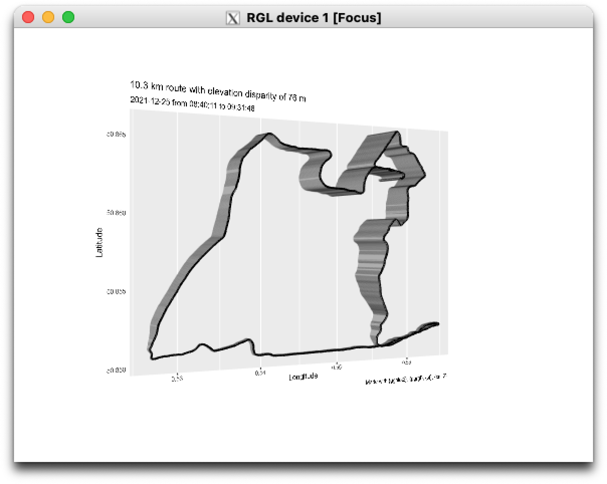
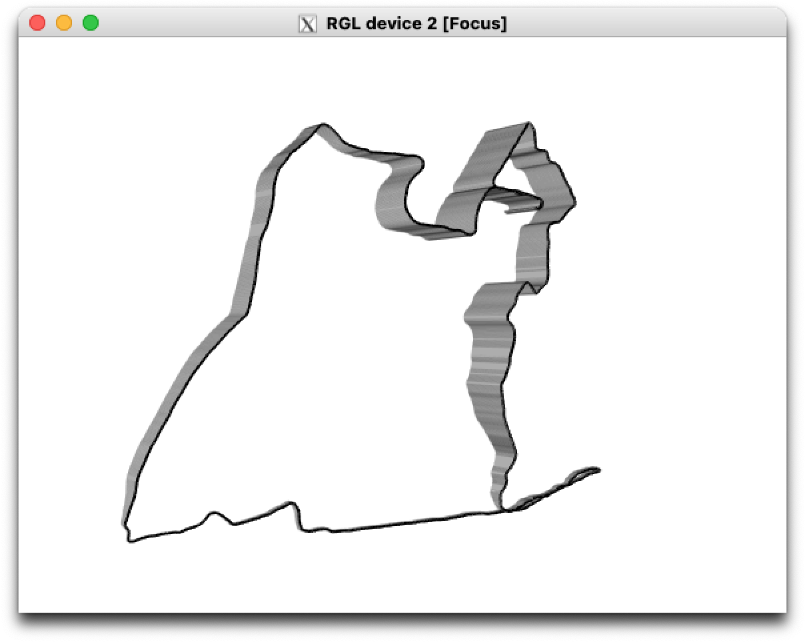
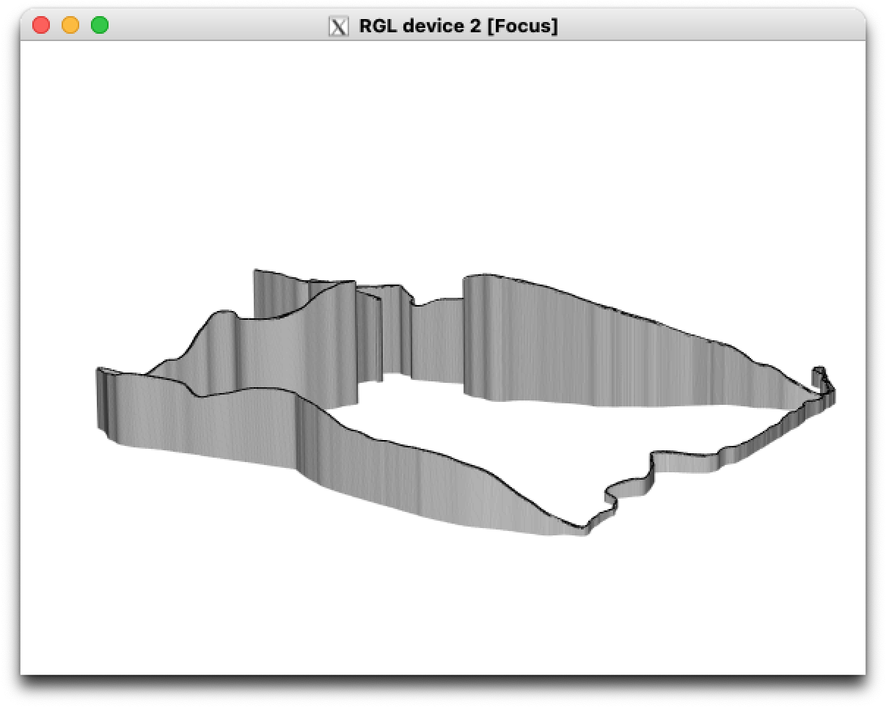

<!-- README.md is generated from README.Rmd. Please edit that file -->

# {gpx3d}

<!-- badges: start -->

[](https://www.repostatus.org/#wip)
[](https://CRAN.R-project.org/package=gfx3d)
[](https://github.com/matt-dray/gpx3d/actions)
[](https://codecov.io/gh/matt-dray/gpx3d?branch=main)
<!-- badges: end -->

An in-development, opinionated package to create interactive 3D plots of
workout routes.

Takes a .gpx file—downloaded from Apple Health for example—and extracts
the time, coordinates and elevation into an sf-class object. You can
then plot this as a 3D interactive object thanks to
[{ggrgl}](https://coolbutuseless.github.io/package/ggrgl/index.html).

## Install

The package is available from GitHub only.

``` r
install.packages("remotes")  # if not installed already
remotes::install_github("matt-dray/gpx3d")
library(gpx3d)
```

There are a number of dependencies. You must also [install
XQuartz](https://www.xquartz.org/), if you haven’t already.

## Example

I downloaded my data from the Apple Health app and unzipped it. The
apple\_health\_export/workout-routes/ directory contains .gpx files for
recorded workouts. I’ll use a file that represents a 10 km run I took on
Christmas morning.

``` r
x <- "apple_health_export/workout-routes/route_2021-12-25_9.31am.gpx"
y <- extract_gpx_route(x)
y
```

    # Simple feature collection with 3097 features and 5 fields
    # Geometry type: POINT
    # Dimension:     XY
    # Bounding box:  xmin: 0.526628 ymin: 50.85036 xmax: 0.564496 ymax: 50.86593
    # Geodetic CRS:  WGS 84
    # First 10 features:
    #                   time      ele      lon      lat                  geometry     distance
    # 1  2021-12-25 08:40:11 55.15309 0.556028 50.86274 POINT (0.556028 50.86274) 0.000000 [m]
    # 2  2021-12-25 08:40:12 55.10019 0.556053 50.86273 POINT (0.556053 50.86273) 2.077275 [m]
    # 3  2021-12-25 08:40:13 55.05168 0.556078 50.86272 POINT (0.556078 50.86272) 2.138860 [m]
    # 4  2021-12-25 08:40:14 55.01673 0.556105 50.86271 POINT (0.556105 50.86271) 2.142997 [m]
    # 5  2021-12-25 08:40:15 54.99454 0.556133 50.86270  POINT (0.556133 50.8627) 2.075322 [m]
    # 6  2021-12-25 08:40:16 54.99935 0.556164 50.86270  POINT (0.556164 50.8627) 2.187047 [m]
    # 7  2021-12-25 08:40:17 55.02570 0.556197 50.86271 POINT (0.556197 50.86271) 2.410257 [m]
    # 8  2021-12-25 08:40:18 55.06934 0.556231 50.86272 POINT (0.556231 50.86272) 2.789951 [m]
    # 9  2021-12-25 08:40:19 55.13774 0.556263 50.86274 POINT (0.556263 50.86274) 3.160661 [m]
    # 10 2021-12-25 08:40:20 55.23403 0.556294 50.86277 POINT (0.556294 50.86277) 3.618288 [m]

Use `plot_gpx_route()` to plot the object output from
`extract_gpx_route()`. This opens in an external RGL device.

``` r
plot_gpx_route(y)
```

The plots can’t be embedded here, so here’s a screenshot.

<div class="figure">



</div>

I was running at the coast, so the most southern part of the route is
flat and near sea-level (min elevation of 3 m). I started inland, so had
to descend before going back uphill (max elevation of 73 m).

You can use `route_only = TRUE` to remove all of the chart elements
except for the route itself.

``` r
plot_gpx_route(y, route_only = TRUE)
```

<div class="figure">



</div>

The chart is interactive so you can click and drag the chart, and scroll
to zoom. here’s a more exaggerated view of the climb from the
south-west.

<div class="figure">



</div>

## Thanks

This package wouldn’t be possible without:

-   [{ggrgl}](https://coolbutuseless.github.io/package/ggrgl/index.html)
    and friends by [mikefc (AKA
    coolbutuseless)](https://coolbutuseless.github.io/)
-   [{ggplot2} by Hadley Wickham](https://ggplot2.tidyverse.org/)
-   [{xml2} by Hadley Wickham, Jim Hester and Jeroen
    Ooms](https://xml2.r-lib.org/)
-   [{sf} by Edzer Pebesma](https://r-spatial.github.io/sf/appl)
-   [Apple’s Health app](https://www.apple.com/uk/ios/health/mikefc)

## Code of Conduct

Please note that the {gpx3d} project is released with a [Contributor
Code of
Conduct](https://contributor-covenant.org/version/2/0/CODE_OF_CONDUCT.html).
By contributing to this project, you agree to abide by its terms.
